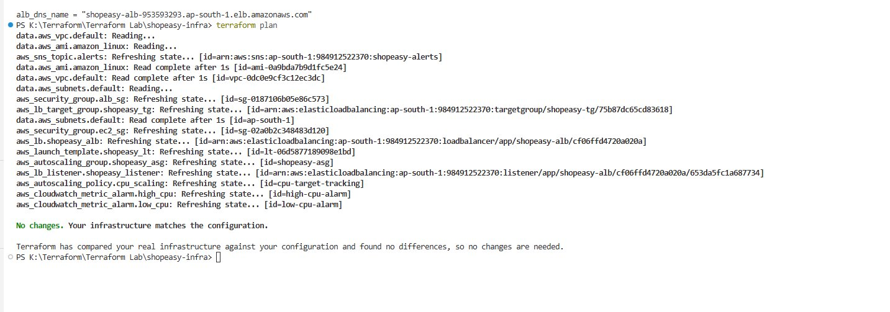
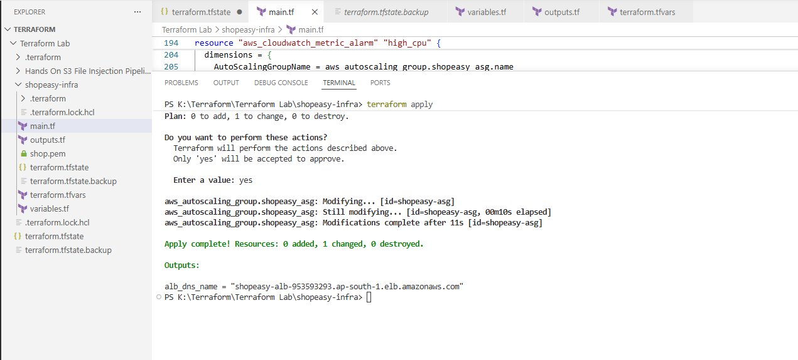
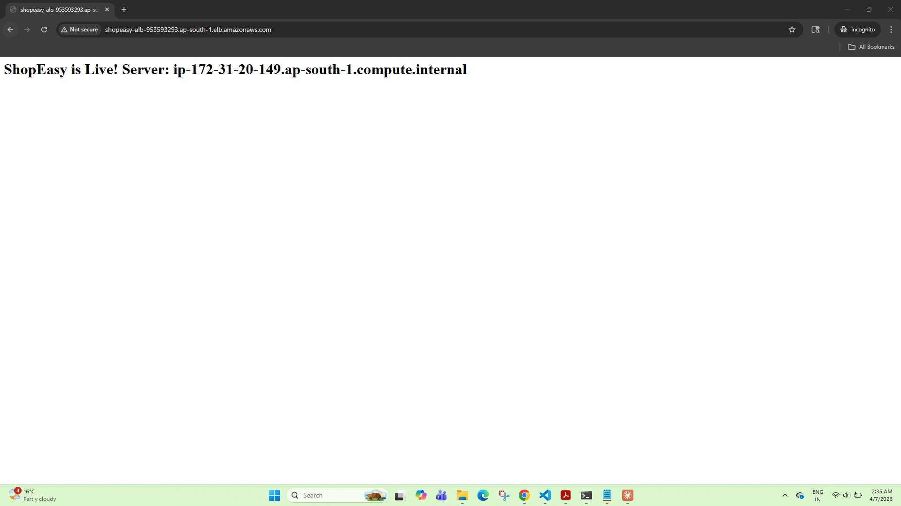
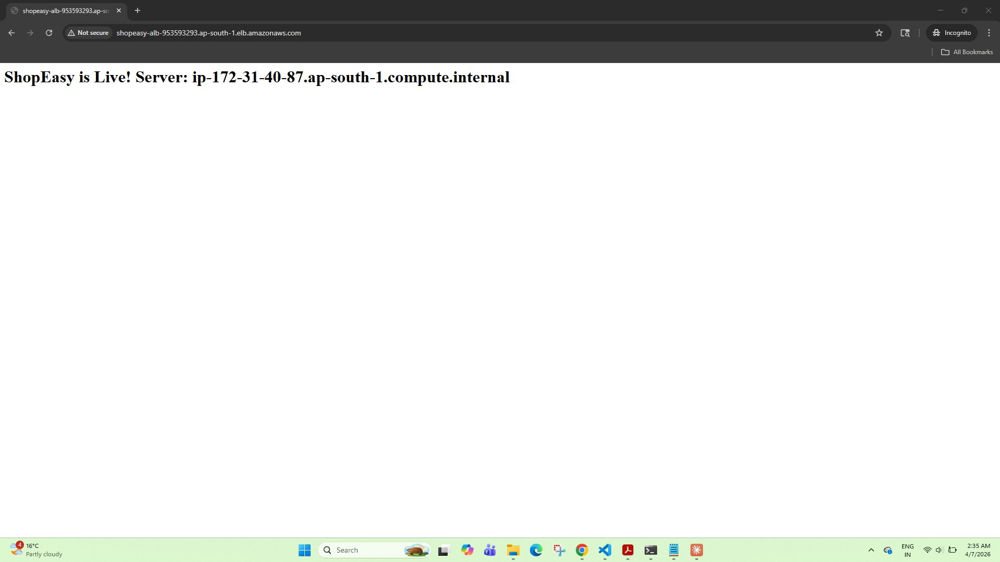
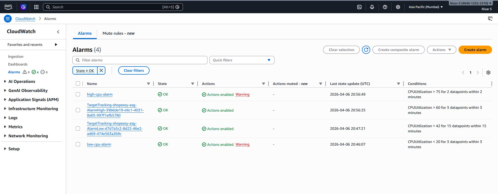
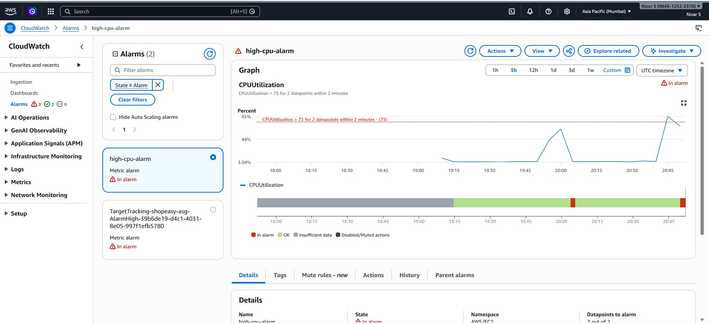
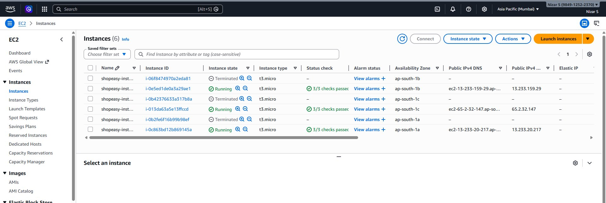

# ShopEasy — AWS Auto Scaling Infrastructure with Terraform

> **CloudOps Engineer Track | Beginner Level | Region: ap-south-1 (Mumbai)**

---

## 📋 Project Overview

ShopEasy is an e-commerce startup that faced server crashes during traffic spikes in previous sales events. This project builds a **fault-tolerant, auto-scaling AWS infrastructure using Terraform** that:

- Automatically adds EC2 instances when traffic spikes (scale-out)
- Removes instances when traffic drops to save cost (scale-in)
- Distributes incoming requests across multiple instances via an ALB
- Alerts the team via SNS when CPU utilization behaves abnormally

---

## 🏗️ Architecture

```
Internet User
     │
     ▼
[Application Load Balancer] ── shopeasy-alb (internet-facing, port 80)
     │
     ▼
[Target Group] ── shopeasy-tg (HTTP:80, health check GET /)
     │
     ▼
[Auto Scaling Group] ── shopeasy-asg (min=1, desired=2, max=4)
  ├── EC2 Instance (AZ: ap-south-1a) ── InService
  ├── EC2 Instance (AZ: ap-south-1b) ── InService
  └── EC2 Instance (AZ: ap-south-1b) ── Pending (during stress test)
     │
     └── Launch Template: shopeasy-lt
         AMI: Amazon Linux 2023 (dynamic)
         Instance Type: t3.micro
         User Data: installs httpd + stress-ng

[CloudWatch Alarms] ──────────────────────────────────────────────
  ├── High CPU Alarm  → CPUUtilization > 75% (2 periods × 60s)
  ├── Low CPU Alarm   → CPUUtilization < 20% (3 periods × 60s)
  └── Target Tracking → ASGAverageCPUUtilization target = 60%
         │
         ▼ alerts
  [SNS Topic: shopeasy-alerts] → Email / SMS notification
```

---

## 📁 File Structure

```
shopeasy-infra/
├── main.tf           # All AWS resources
├── variables.tf      # Input variable definitions
├── outputs.tf        # ALB DNS name output
└── terraform.tfvars  # Variable values
```

---

## 🔧 Prerequisites

- [Terraform](https://www.terraform.io/downloads) >= 1.0
- [AWS CLI](https://aws.amazon.com/cli/) configured with a profile
- IAM permissions for EC2, ALB, ASG, CloudWatch, SNS

```bash
aws configure --profile shopeasy
```

---

## ⚙️ Variables

| Variable | Description | Default |
|---|---|---|
| `region` | AWS region | `ap-south-1` |
| `instance_type` | EC2 instance type | `t3.micro` |
| `min_size` | ASG minimum instances | `1` |
| `max_size` | ASG maximum instances | `4` |
| `desired_capacity` | ASG desired instances | `2` |

---

## 🚀 Deployment Steps

```bash
# 1. Clone the repository
git clone https://github.com/<your-username>/shopeasy-infra.git
cd shopeasy-infra

# 2. Initialize Terraform
terraform init

# 3. Validate configuration
terraform validate

# 4. Preview changes
terraform plan

# 5. Apply infrastructure
terraform apply
```

---

## ✅ Tasks Completed

### Task 1 — Project Initialization
- [x] Created `shopeasy-infra/` project folder
- [x] Set up `main.tf`, `variables.tf`, `outputs.tf`, `terraform.tfvars`
- [x] Configured AWS provider for `ap-south-1` with version `~> 5.0`
- [x] Defined variables: `region`, `instance_type`, `min_size`, `max_size`, `desired_capacity`

### Task 2 — Networking & Security Groups
- [x] Used default VPC with dynamically fetched subnets via data sources
- [x] Created ALB Security Group — inbound HTTP (port 80) from `0.0.0.0/0`
- [x] Created EC2 Security Group — inbound HTTP only from ALB security group

### Task 3 — Launch Template
- [x] Fetched latest Amazon Linux 2023 AMI dynamically (no hardcoded AMI ID)
- [x] Created `aws_launch_template` named `shopeasy-lt`
- [x] Instance type `t3.micro` with EC2 security group attached
- [x] User Data installs `httpd` and `stress-ng` via `dnf`, enables and starts `httpd`
- [x] HTML response: `<h1>ShopEasy is Live! Server: $(hostname -f)</h1>`

### Task 4 — Application Load Balancer (ALB)
- [x] Created `aws_lb`: `shopeasy-alb`, internet-facing, type `application`
- [x] Created `aws_lb_target_group`: port 80, HTTP, health check on `/` expecting 200
- [x] Created `aws_lb_listener`: port 80, forward action to target group
- [x] ALB DNS name exported via `outputs.tf`

### Task 5 — Auto Scaling Group
- [x] Created `aws_autoscaling_group` named `shopeasy-asg`
- [x] References Launch Template with `version = "$Latest"`
- [x] Attached to ALB target group via `target_group_arns`
- [x] `min_size = 1`, `max_size = 4`, `desired_capacity = 2`
- [x] `vpc_zone_identifier` from subnets data source (multiple AZs)
- [x] `health_check_type = "ELB"`, grace period 300 seconds
- [x] Instances tagged: `Name = shopeasy-instance`, `propagate_at_launch = true`

### Task 6 — Scaling Policy
- [x] Created `aws_autoscaling_policy` with `policy_type = "TargetTrackingScaling"`
- [x] Predefined metric: `ASGAverageCPUUtilization` with `target_value = 60`
- [x] Single policy handles both scale-out and scale-in automatically

### Task 7 — CloudWatch Alarms & SNS
- [x] Created `aws_sns_topic` named `shopeasy-alerts`
- [x] High CPU Alarm: `CPUUtilization > 75%` for 2 evaluation periods (60s each)
- [x] Low CPU Alarm: `CPUUtilization < 20%` for 3 evaluation periods (60s each)
- [x] Both alarms use dimensions linked to the ASG name
- [x] `alarm_actions` set to SNS topic ARN for both alarms

---

## 📸 Evidence Screenshots

### Screenshot 1 — `terraform plan` Output
> Terraform refreshed all resources and confirmed **"No changes. Your infrastructure matches the configuration."**
> All resources visible: VPC, subnets, security groups, ALB, target group, listener, launch template, ASG, scaling policy, CloudWatch alarms, SNS topic.



---

### Screenshot 2 — `terraform apply` Completed
> Apply completed successfully: **0 added, 1 changed, 0 destroyed.**
> ALB DNS name output: `shopeasy-alb-953593293.ap-south-1.elb.amazonaws.com`



---

### Screenshot 3 — ASG Instances in EC2 Console
> Auto Scaling Group launched **3 running instances** across multiple Availability Zones (ap-south-1a, ap-south-1b, ap-south-1c), all passing 3/3 status checks. 3 terminated instances confirm scale-in after stress test cooldown.

| Instance ID | State | AZ | Type |
|---|---|---|---|
| i-0e5ed1de0a3a29ae1 | ✅ Running | ap-south-1b | t3.micro |
| i-013da63a5e13ffccd | ✅ Running | ap-south-1c | t3.micro |
| i-0c863bd12b869145a | ✅ Running | ap-south-1a | t3.micro |


---

### Screenshot 4 — ALB DNS in Browser (Load Balancing Confirmed)
> The ALB DNS URL `shopeasy-alb-953593293.ap-south-1.elb.amazonaws.com` returns the ShopEasy page.
> Refreshing the page shows **different hostnames** — confirming load balancing is working across instances.

**Refresh 1:** `ShopEasy is Live! Server: ip-172-31-20-149.ap-south-1.compute.internal`



**Refresh 2:** `ShopEasy is Live! Server: ip-172-31-40-87.ap-south-1.compute.internal`



---

### Screenshot 5 — CloudWatch Alarms (OK State — After Stress Test)

All 4 alarms returned to **OK** state after the stress test cooldown period:

| Alarm | Condition | Last Updated (UTC) | State |
|---|---|---|---|
| high-cpu-alarm | CPUUtilization > 75 for 2 datapoints/2 min | 2026-04-06 20:56:49 | ✅ OK |
| TargetTracking-AlarmHigh | CPUUtilization > 60 for 3 datapoints/3 min | 2026-04-06 20:56:25 | ✅ OK |
| TargetTracking-AlarmLow | CPUUtilization < 42 for 15 datapoints/15 min | 2026-04-06 20:47:21 | ✅ OK |
| low-cpu-alarm | CPUUtilization < 20 for 3 datapoints/3 min | 2026-04-06 20:46:07 | ✅ OK |



---

### Screenshot 6 — CloudWatch Alarm in ALARM State (Stress Test)
> After running `stress-ng --cpu 4 --timeout 300s`, the `high-cpu-alarm` triggered.
> CPU spiked well above the **75% threshold** (2 evaluation periods × 60s).
> Both `high-cpu-alarm` and `TargetTracking-AlarmHigh` entered **IN ALARM** state.



---

### Screenshot 7 — New Instances Launched by ASG During Stress Test
> ASG scaled out from 2 → 3 instances in response to the CPU spike.
> EC2 console shows 6 total instances: 3 running (current) + 3 terminated (scaled in after cooldown).
> Terminated instances are evidence of the full scale-out → scale-in cycle.



---

## 🧪 Testing

After `terraform apply` completes:

```bash
# 1. Copy ALB DNS from Terraform output
terraform output alb_dns_name

# 2. Open in browser — should show ShopEasy page
# 3. Refresh multiple times — hostname changes (load balancing works)

# 4. SSH into an instance and run stress test
ssh -i <key>.pem ec2-user@<instance-ip>
stress-ng --cpu 4 --timeout 300s

# 5. Watch ASG in AWS Console — new instances launch in ~2-3 minutes
# 6. After stress ends — instances terminate after cooldown
```

---

## 🗑️ Cleanup

> ⚠️ Always destroy resources after the assignment to avoid AWS charges (ALB + EC2 instances incur costs).

```bash
terraform destroy
```

---

## 📝 Notes

- **Amazon Linux 2023** uses `dnf` for package management (not `yum`)
- **`stress-ng`** is used instead of the legacy `stress` package
- AMI ID is fetched dynamically — never hardcoded
- No AWS credentials are hardcoded in any `.tf` files
- Target Tracking Scaling handles both scale-out and scale-in with a single policy

---

## 👤 Author

**Nizar S**  
CloudOps Engineer Track — AWS Auto Scaling with Terraform  
Region: ap-south-1 (Mumbai)
